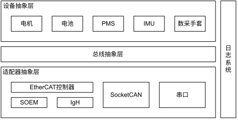
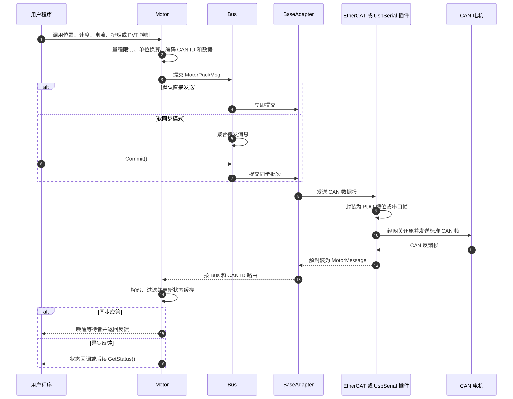

# EncosDriver 架构设计

## 一、设计目标

EncosDriver 面向上层控制程序提供统一的电机与外设接口，并把设备控制语义与具体通信链路隔离。应用只需要选择 Adapter、Bus 和设备，不需要针对 EtherCAT 或 USB 串口分别实现控制算法。

系统以 CAN 数据报作为统一的业务消息：一条消息包含 CAN ID、帧属性、有效数据长度和最多 8 字节数据。CAN 本身是标准总线协议；EtherCAT 与 UsbSerial 插件不定义新的电机控制语义，只负责将同一条 CAN 数据报封装到各自的传输载体中，并在接收端还原。

整体设计遵循以下原则：

- **控制与传输解耦**：`Motor` 负责控制量编解码，Adapter 插件负责数据报传输。
- **分层管理**：Adapter 管理物理接口，Bus 表示逻辑 CAN 总线，Motor 表示单个设备。
- **统一路由**：接收数据按 Adapter、Bus 和 CAN ID 路由到对应设备。
- **兼顾实时与易用性**：默认直接发送；需要周期对齐时可启用软同步批量提交。
- **集中管理生命周期**：Adapter、Bus 和设备对象由 `EncosDriverManager` 统一创建、注册和销毁。

## 二、层级架构



### 2.1 API 与对象管理层

应用通过 `MakeAdapter()` 创建通信适配器，再从 Adapter 获取 Bus，并从 Bus 获取或扫描 Motor。`EncosDriverManager` 位于公开对象体系背后，负责对象所有权、设备注册、接收路由以及销毁期间的并发保护。

调用方获得的 Adapter、Bus 和 Motor 均为非拥有指针，不应自行释放。这样的集中式所有权可以保证接收线程不会把消息投递给已经销毁的设备。

### 2.2 设备控制层

`Motor` 是主要的控制语义入口，提供以下控制模式：

| 控制模式 | 接口 | 主要输入 |
|---|---|---|
| 力位混合控制 | `PVTControl` | Kp、Kd、位置、速度、扭矩 |
| 位置控制 | `PosControl` | 目标位置、速度限制、电流限制 |
| 速度控制 | `SpdControl` | 目标速度、电流限制 |
| 电流控制 | `CurControl` | 目标电流 |
| 扭矩控制 | `TorControl` | 目标扭矩 |
| 停止与制动 | `Stop`、`Brake` | 停止方式、制动电流或抱闸状态 |

该层完成单位换算、量程限制和位域编码，将控制参数转换为 CAN ID 加 8 字节数据区的业务报文。收到反馈后，它执行反馈解码、状态过滤、缓存更新、同步等待者唤醒以及状态回调。

除 Motor 外，Bus 也可承载 Battery、IMU、PMS 等设备。它们复用相同的消息提交和 ID 路由机制，但各自负责自身的数据编解码。

### 2.3 Bus 与消息路由层

`Bus` 表示一条逻辑 CAN 总线，是设备与 Adapter 之间的边界。它主要负责：

- 创建、查询和扫描总线上的设备；
- 为设备发送通道补充 `bus_idx`；
- 在软同步模式下聚合同一 Bus 的待发消息；
- 保存尚未注册路由的未知 ID 报文，供扫描和总线级协议处理。

UsbSerial 只提供索引为 0 的单条 Bus。EtherCAT 网关可包含多个从站，每个从站又可暴露多条 CAN Bus；系统使用组合索引表示它们：

```text
bus_idx = (slave_idx << 16) | bus_idx_in_slave
```

接收时，`BaseAdapter::OnMessage()` 将消息交给管理器。管理器按 Adapter、Bus 索引和 CAN ID 查找路由：已注册消息进入对应 Motor 或外设，未匹配消息进入 Bus 的未知消息邮箱。

### 2.4 Adapter 与插件层

`BaseAdapter` 定义统一的发送、批量发送、同步批次发送和接收入口。具体插件只处理传输差异：

- EtherCAT 插件把多条 CAN 数据报放入周期 PDO 槽位；
- UsbSerial 插件给单条 CAN 数据报增加串口帧头、长度和校验和。

因此，插件切换不会改变 Motor 控制报文的含义。EtherCAT 的不同主站实现共享同一套 CAN-over-EtherCAT PDO 编解码规则，本章统一称为 EtherCAT 插件。

## 三、控制逻辑

### 3.1 初始化流程

典型初始化顺序如下：

1. 创建 Adapter 并打开对应物理接口。
2. 获取或枚举 Bus。
3. 扫描电机，或按已知 ID 和型号创建 Motor。
4. 完成参数读取、量程初始化及其他需要同步应答的配置。
5. 如需周期批量控制，再启用 Bus 或 Adapter 的软同步模式。

需要等待响应的初始化操作应在软同步模式开启前完成，否则请求可能留在待提交队列中并等待超时。

### 3.2 命令下发与反馈回传



控制接口首先把 SI 单位的目标值限制在当前电机量程内，再编码进业务 CAN 数据报。数据报经 Bus 补充逻辑总线索引后提交给 Adapter，插件随后选择对应的物理封装并发送。

接收方向执行完全相反的过程：插件先从 PDO 或串口字节流中还原 CAN 数据报，Adapter 再按 Bus 与 CAN ID 分发，最终由 Motor 解码成位置、速度、电流、温度和错误状态等上层数据。

### 3.3 直接发送与软同步

默认情况下，控制报文在生成后立即提交给 Adapter。该方式链路短、使用简单，适合普通控制和初始化操作。

启用 `SetSyncMode(true)` 后，报文先保留在 Bus 的发送队列中，直到调用 `Commit()` 才作为一个批次交给 Adapter。软同步用于保留控制批次边界，但有两个重要限制：

- `Commit()` 返回只表示 Adapter 已接收该批次，不表示物理链路已经发出，也不表示电机已经执行；
- EtherCAT 插件仍按自身周期发送，UsbSerial 插件仍按串口发送机制工作。

EtherCAT 会保留同一 Bus 上不同同步批次的边界，避免它们被合并进同一底层输出包；不同 Bus 的消息仍可共享空闲 PDO 槽位。

### 3.4 反馈消费方式

控制层支持三种反馈使用方式：

| 方式 | 行为 | 适用场景 |
|---|---|---|
| 同步应答 | 控制调用等待匹配反馈后返回 | 低频配置、需要确认本次结果 |
| 异步回调 | 控制调用立即返回，反馈由 `SetOnStatus()` 通知 | 高频控制与事件驱动处理 |
| 状态轮询 | 控制调用立即返回，之后通过 `GetStatus()` 读取缓存 | 控制循环与状态读取解耦 |

Motor 收到有效反馈后会先更新状态缓存及生命周期，再唤醒匹配的同步等待者，最后触发状态回调。回调运行在 Adapter 的接收线程中，应保持短小且不可阻塞。

## 四、统一 CAN 数据报

CAN 是控制系统的标准业务协议。EtherCAT 和 UsbSerial 只是其包装层，不修改 ID 与 8 字节数据区内的电机协议。

库内使用 `MotorMessage` 表示一条带逻辑 Bus 的消息，其中 `MotorPackMsg` 是紧凑 CAN 报文：

| 字段 | 大小 | 说明 |
|---|---:|---|
| `bus_idx` | 进程内整型 | 逻辑 Bus 路由信息，不属于物理 CAN 帧 |
| `id` | 4 字节 | CAN 标识符，可表达标准帧或扩展帧 ID |
| `frame_flags` | 1 字节 | 标准/扩展、CAN FD、RTR 等帧属性 |
| `len` | 1 字节 | `data` 中的有效字节数，范围为 0～8 |
| `data` | 8 字节 | 电机控制命令或设备反馈数据 |

`MotorPackMsg` 的打包大小为 14 字节。这里的 14 字节是库内及包装协议使用的记录格式，并不表示经典 CAN 物理帧具有 14 字节载荷；真正的业务载荷仍是最多 8 字节。

## 五、EtherCAT 插件通信协议

### 5.1 协议定位

EtherCAT 插件实现 CAN over EtherCAT：主站与 EtherCAT-CAN 网关之间通过周期 PDO 交换一组 CAN 数据报，网关再在对应 CAN Bus 上发送或接收这些报文。

```text
MotorPackMsg[] → EtherCAT 输出 PDO → EtherCAT-CAN 网关 → CAN Bus
CAN Bus → EtherCAT-CAN 网关 → EtherCAT 输入 PDO → MotorPackMsg[]
```

所有 EtherCAT 主站实现共用相同的 PDO 分类、槽位打包和输入解码逻辑，因此它们之间的区别仅在主站驱动与平台接入，不在电机通信协议。

### 5.2 PDO 槽位

每个 CAN 槽位直接保存一条 14 字节 `MotorPackMsg`：

| 偏移 | 大小 | 内容 |
|---:|---:|---|
| 0 | 4 字节 | CAN ID |
| 4 | 1 字节 | 帧属性 |
| 5 | 1 字节 | 有效数据长度 |
| 6 | 8 字节 | CAN 数据区 |

从站的 PDO 大小决定其 Bus 数量与每条 Bus 的槽位数。当前公共编解码层支持以下布局：

| PDO 类型 | Bus 数 | 每条 Bus 每周期槽位数 | 附加字段 |
|---|---:|---:|---|
| 经典 CAN 双 Bus | 2 | 3 | 报文数量、扩展帧标志 |
| 经典 CAN 八 Bus | 8 | 3 | 报文数量、扩展帧标志、保留字节 |
| 八 Bus 网关 | 8 | 8 | 无 |
| 八 Bus 十槽网关 | 8 | 10 | 无 |
| 三 Bus 网关 | 3 | 8 | 无 |
| 手套从站 | 5 | 10 | 无 |

发送时，系统根据组合 `bus_idx` 找到从站及从站内 Bus，再将 CAN 数据报写入该 Bus 的空闲槽位；单个周期容纳不下的消息会进入后续输出帧。接收时，槽位所在位置反推出 Bus，`len == 0` 的空槽位会被忽略。

EtherCAT 的作用是批量、周期性搬运 CAN 数据报。电机看到的仍是原始 CAN ID 与数据，上层也只接收还原后的 CAN 数据报。

## 六、UsbSerial 插件通信协议

### 6.1 协议定位

UsbSerial 插件实现 CAN over Serial：每条 CAN 数据报独立封装为一个串口帧，通过 115200 baud 串口发送。插件只提供一条逻辑 Bus，索引固定为 0。

### 6.2 标准 ID 帧

标准 CAN ID 使用 2 字节大端序编码：

| 字段 | 大小 | 说明 |
|---|---:|---|
| 帧头 | 1 字节 | 固定为 `0xAA` |
| CAN ID | 2 字节 | 高字节在前 |
| 总长度 | 1 字节 | 从帧头到校验和的总字节数 |
| 数据 | 0～8 字节 | CAN 数据区 |
| 校验和 | 1 字节 | 前面所有字节累加和的低 8 位 |

若有效数据长度为 `N`，标准 ID 串口帧总长度为 `N + 5`。

### 6.3 扩展 ID 帧

扩展 CAN ID 使用 4 字节大端序编码：

| 字段 | 大小 | 说明 |
|---|---:|---|
| 帧头 | 1 字节 | 固定为 `0xBB` |
| CAN ID | 4 字节 | 最高字节在前 |
| 总长度 | 1 字节 | 从帧头到校验和的总字节数 |
| 数据 | 0～8 字节 | CAN 数据区 |
| 校验和 | 1 字节 | 前面所有字节累加和的低 8 位 |

若有效数据长度为 `N`，扩展 ID 串口帧总长度为 `N + 7`。

接收线程从字节流中搜索 `0xAA` 或 `0xBB`，读取总长度，等待完整帧并验证校验和。校验通过后，插件还原 CAN ID、扩展帧属性、有效长度和最多 8 字节数据，再交给统一路由层。

当前发送器会立即写出一次串口帧，并在约 3 ms 后再次写出同一帧，以降低临时串口传输失败对调试链路的影响。因此 UsbSerial 更适合临时调试和低速场景，不应把串口封装或重发行为当作电机协议的一部分。

## 七、架构边界总结

从控制系统角度看，稳定的协议边界位于 `MotorPackMsg`：

- Motor 决定 CAN ID 和 8 字节数据区的控制含义；
- Bus 决定消息属于哪条逻辑 CAN 总线；
- Adapter 决定消息如何提交、批量和接收；
- EtherCAT 与 UsbSerial 插件决定 CAN 数据报如何在各自链路中封装；
- 接收路径最终必须还原出同样的 CAN ID、帧属性、有效长度和数据区。

这种边界使同一套控制逻辑可以在 EtherCAT 网关与 USB 转 CAN 设备之间复用，新增传输插件时也无需修改电机控制协议。
