# EncosDriver 日志与故障排查指南

本文说明 EncosDriver 中两类用途不同的日志：

- **电机数据日志**：由 `Motor::EnableLog()` 启用，以 CSV 数据流保存控制命令和状态反馈，适合离线分析、绘图和控制效果复盘。
- **系统运行日志**：核心库和各 Adapter 插件通过 `encos::Logger` 输出；原生默认后端为 spdlog，适合观察初始化、通信链路、队列负载和故障恢复过程。

## 1. 电机数据日志

### 1.1 使用方式

每个 `Motor` 独立控制自己的日志会话：

```cpp
#include <encos/encos_motor.h>

auto* adapter = encos::MakeAdapter("Can", "can0");
auto* bus = adapter->GetBus(0);
auto* motor = bus->GetMotor(1, encos::MotorModel::EC_A4310_P2);

motor->EnableLog("logs/joint_1");

motor->SpdControl<0>(1.5F, 3.0F);
// 运行控制循环……

motor->DisableLog();  // 等待剩余记录压缩、刷盘并关闭两个文件
```

调用方需要先创建 `base_name` 所在目录。`EnableLog()` 不负责创建父目录，路径无效或没有写权限时会抛出异常。

日志会话的行为如下：

- 第一次调用 `EnableLog(base_name)` 时同时创建命令和状态文件。
- 已使用同一 `base_name` 记录时再次调用是空操作。
- 改用另一个 `base_name` 时会先完整关闭旧会话，再创建一对新文件。
- `DisableLog()` 会等待队列排空和文件刷新；刷新失败会抛出异常，但日志状态仍会被清理。
- `Motor` 析构时也会尝试关闭日志。析构路径不能向调用方抛异常，因此失败只会写入系统日志。
- `IsLogged()` 仅表示当前存在完整的命令/状态日志会话，不表示磁盘有足够空间，也不保证后台写入尚未发生错误。

### 1.2 文件命名

假设基础名称为 `logs/joint_1`，正常创建：

| 文件 | 内容 |
| --- | --- |
| `logs/joint_1_command.csv.zstd` | 控制命令 |
| `logs/joint_1_status.csv.zstd` | 电机状态反馈 |

文件以“仅当不存在时创建”的方式打开，不会覆盖旧日志。如果目标文件已存在，实际文件名会增加 Unix 秒时间戳，例如：

```text
logs/joint_1_command_1787971200.csv.zstd
logs/joint_1_status_1787971200.csv.zstd
```

命令和状态写入器分别寻找可用名称，所以在存在同名历史文件或故障恢复后，两者的时间戳后缀不保证完全相同。归档时应按创建时间和表头配对，不应只依赖相同后缀。

### 1.3 架构设计

电机控制和状态接收路径不能承担压缩与文件 I/O。日志链路因此分为三层：



关键设计取舍：

- **生产路径不做文件 I/O**：命令记录和状态记录先进入两个相互独立的单生产者/单消费者 `Port`。
- **有界内存**：两个 Port 的逻辑容量均为 1024 条。消费者落后超过容量时，旧记录会被覆盖，读取端从仍保留的最旧记录继续；控制线程不会为了日志等待磁盘。
- **批量压缩**：CSV 数据累计到 1 MiB 后提交给进程级写线程。每批数据独立压成一个 Zstd frame，并顺序追加到文件；标准 `zstd -d` 能连续解压这些 frame。
- **关闭时完整排空**：显式关闭先禁止新记录，再等待命令和状态 Port 清空，最后刷新两个写入器。
- **故障隔离**：每个电机拥有独立日志会话；一个电机的日志恢复不会重建其他电机的文件。

### 1.4 时间戳和数值格式

两张表的 `timestamp_ns` 都是记录产生时的系统时钟：

```text
std::chrono::system_clock::now().time_since_epoch()，单位 ns
```

它适合与同一主机上的系统日志或其他 Unix epoch 时间源对齐，但不是单调时钟。运行期间校时可能导致时间戳跳变或倒退。大多数控制命令在发送完成（需要反馈时则在等待结束）后取时间戳；`Brake` 在发送前记录。状态时间戳在有效反馈完成解码和过滤、准备分发给日志及用户回调时获取。因此这些时间都不是总线硬件时间戳，也不能精确表示报文到达线缆的时刻。

CSV 使用以下规则：

- 浮点数使用 classic locale 和足以往返还原的最大有效位数，不受系统小数点区域设置影响。
- `nan`、`inf`、`-inf` 使用对应小写文本。
- 可选字段未参与当前命令时写成空字段，而不是 `0`。
- 布尔值写成 `true` 或 `false`。
- 每个文件首行固定为表头，行尾为 `\n`。

### 1.5 命令日志格式

命令文件固定包含 11 列：

```csv
timestamp_ns,type,kp,kd,position,speed,current,torque,stop_mode,brake_enabled,feedback
```

| 列 | 类型/单位 | 说明 |
| --- | --- | --- |
| `timestamp_ns` | `int64`，ns | Unix epoch 纳秒时间戳 |
| `type` | 字符串 | `PVTControl`、`PosControl`、`SpdControl`、`CurControl`、`TorControl`、`Stop` 或 `Brake` |
| `kp` | 浮点数 | PVT 比例增益 |
| `kd` | 浮点数 | PVT 微分增益 |
| `position` | rad | 目标位置 |
| `speed` | rad/s | 目标速度 |
| `current` | A | 目标或限制电流 |
| `torque` | N·m | 目标转矩 |
| `stop_mode` | 整数 | `2` 全制动、`3` 动态制动、`4` 回馈制动 |
| `brake_enabled` | 布尔值 | 机械制动器启用状态 |
| `feedback` | 整数 | 请求的反馈类型；不适用时为空 |

各命令使用的字段如下，`—` 表示 CSV 中为空：

| `type` | `kp` | `kd` | `position` | `speed` | `current` | `torque` | `stop_mode` | `brake_enabled` | `feedback` |
| --- | --- | --- | --- | --- | --- | --- | --- | --- | --- |
| `PVTControl` | 有 | 有 | 有 | 有 | — | 有 | — | — | `0` 或 `1` |
| `PosControl` | — | — | 有 | 有 | 有 | — | — | — | `0`～`3` |
| `SpdControl` | — | — | — | 有 | 有 | — | — | — | `0`～`3` |
| `CurControl` | — | — | — | — | 有 | — | — | — | `0`～`3` |
| `TorControl` | — | — | — | — | — | 有 | — | — | `0`～`3` |
| `Stop` | — | — | — | — | 有 | — | 有 | — | `0`～`3` |
| `Brake` | — | — | — | — | — | — | — | 有 | — |

注意：日志保存的是驱动实际编码使用的值，而不总是调用方原始实参。PVT 参数会先限制到电机型号允许范围；位置控制的速度和电流也会限制到协议范围并换回 SI 单位后记录。`SetAcceleration()`、参数读写、CAN ID 设置等管理命令不写入命令日志。

### 1.6 状态日志格式

状态文件固定包含 7 列：

```csv
timestamp_ns,error,position,speed,current,motor_temperature,mos_temperature
```

| 列 | 类型/单位 | 说明 |
| --- | --- | --- |
| `timestamp_ns` | `int64`，ns | Unix epoch 纳秒时间戳 |
| `error` | 整数 | `MotorError` 的底层数值 |
| `position` | rad | 已解码且经过已配置状态过滤器的电机位置 |
| `speed` | rad/s | 已解码且经过过滤的速度 |
| `current` | A | 已解码且经过过滤的电流 |
| `motor_temperature` | °C | 已解码且经过过滤的电机温度 |
| `mos_temperature` | °C | 已解码且经过过滤的 MOS 温度 |

`error` 映射：

| 值 | 枚举 | 含义/建议 |
| ---: | --- | --- |
| 0 | `NoError` | 正常 |
| 1 | `OverTemperature` | 电机过温；停止高负载，检查散热和环境温度 |
| 2 | `OverCurrent` | 过流；检查负载卡滞、加速度和电流限制 |
| 3 | `VoltageHigh` | 母线电压过高；检查电源和回馈能量吸收 |
| 4 | `VoltageLow` | 母线电压过低；检查电源容量、压降和接线 |
| 5 | `EncoderError` | 编码器异常；检查编码器、线缆、屏蔽和电机配置 |
| 6 | `BrakeVoltageHigh` | 制动电压过高；检查制动回路和母线电压 |
| 7 | `DriverError` | 驱动器内部错误；结合驱动器手册和上电复位结果定位 |
| 8 | `OverTemperatureWarning` | 过温预警；降低负载并检查温升趋势 |
| 255 | `NoResponse` | API 的无响应状态；无响应帧不会写入状态日志 |

只有成功解码且错误值不是 `NoResponse` 的状态才进入 `HandleStatus()`，因此日志文件中通常不会出现 `255`。状态日志记录的是过滤后的值，适合复盘应用实际看到的状态；若要分析总线原始字节，应另外抓取 CAN/EtherCAT 报文。

### 1.7 解压与解析

直接查看：

```bash
zstd -dc logs/joint_1_command.csv.zstd | less
zstd -dc logs/joint_1_status.csv.zstd | less
```

解压成普通 CSV：

```bash
zstd -d logs/joint_1_command.csv.zstd -o logs/joint_1_command.csv
zstd -d logs/joint_1_status.csv.zstd -o logs/joint_1_status.csv
```

Python 标准库可通过 `zstd` 命令读取，不需要依赖 DataFrame 库：

```python
import csv
import io
import subprocess


def read_motor_log(path: str):
    data = subprocess.run(
        ["zstd", "-dc", path],
        check=True,
        stdout=subprocess.PIPE,
    ).stdout.decode("utf-8")
    return list(csv.DictReader(io.StringIO(data)))


commands = read_motor_log("logs/joint_1_command.csv.zstd")
status = read_motor_log("logs/joint_1_status.csv.zstd")

# 转成秒，并保留空字段的“未使用”语义。
first_rows = commands[:1] + status[:1]
if first_rows:
    t0 = min(int(row["timestamp_ns"]) for row in first_rows)
    for row in commands:
        row["time_s"] = (int(row["timestamp_ns"]) - t0) / 1e9
        row["speed"] = float(row["speed"]) if row["speed"] else None
```

该示例会把整个文件读入内存，只适合小型日志；大型日志应让 `zstd -dc` 通过管道逐行交给 `csv.DictReader`。不要以行号对齐命令和状态，两者采样频率不同。应按 `timestamp_ns` 做最近邻、前向保持或固定时间窗匹配，并根据控制周期选择允许误差。

### 1.8 写入故障和自动恢复

后台压缩、写入或刷新失败后，下一次命令记录或状态记录会检测到错误，并输出：

```text
Motor <id> command logging failed; rebuilding log session
Motor <id> status logging failed; rebuilding log session
Failed to rebuild motor log session: <原因>
```

驱动会关闭旧的命令/状态写入器，并以同一 `base_name` **成对重建**，最多连续尝试 3 次；成功写入 10 条命令记录后恢复重试预算。重建产生带时间戳的新文件，分析时需要把同一电机的多个分段按时间排序后合并。全部尝试失败后会清除会话，`IsLogged()` 返回 `false`，但电机控制和用户状态回调继续运行。

常见原因及处理：

| 现象/错误内容 | 原因 | 处理建议 |
| --- | --- | --- |
| `Failed to create log file ...: No such file or directory` | 父目录不存在 | 启用日志前创建目录，并确认运行用户可进入每级目录 |
| `Permission denied` | 目录不可写 | 调整目录所有者/权限；不要用提升权限运行整个控制程序来绕过 |
| `No space left on device` | 磁盘已满或 quota 用尽 | 清理空间，估算采样率和保留时间，加入磁盘监控 |
| `Zstd compression failed` | 压缩器异常或内存问题 | 保留系统资源信息，重启进程；若复现，提交最小复现和日志 |
| `Failed to write/flush log file` | 文件系统、介质或挂载异常 | 检查 `dmesg`、挂载状态、网络盘连接和剩余空间 |
| 析构时出现 `Failed to flush motor logs during destruction` | 退出阶段仍有写入故障 | 优先在正常业务退出流程中显式调用 `DisableLog()`，并处理其异常 |

## 2. 系统与插件日志

### 2.1 Logger 与 spdlog 架构

公共接口使用库自有的 `encos::Logger`/`LoggerPtr`，插件不直接把 spdlog 类型暴露给调用方。原生构建默认 `ENCOS_ENABLE_SPDLOG=ON`：



创建 Adapter 时可以指定记录器名称和过滤级别：

```cpp
auto* adapter = encos::MakeAdapter(
    "Ethercat", "eth0", "robot.left_arm", encos::LogLevel::Debug);
```

未显式提供名称时，插件加载器使用 `<AdapterType>Adapter`，例如 `CanAdapter`、`EthercatAdapter`、`UsbSerialAdapter`。fd broker 子进程使用 `<父记录器名>.FdBroker`。少数内部组件使用固定名称，例如 `CanHandle` 和 `LogWriter`。

同名 spdlog backend 会被复用。新建同名 `encos::Logger` 时会设置该 backend 的级别，因此不要让两个并存 Adapter 使用相同记录器名但期望不同过滤级别。多实例部署建议使用包含接口或设备用途的名称。

### 2.2 输出格式与级别

代码未覆盖 spdlog 的默认 pattern。常见 spdlog 版本的默认输出形态为：

```text
[2026-08-29 14:03:21.527] [robot.left_arm] [warning] Slave 2 has unsupported Obytes: 7
```

可按四部分阅读：本地时间、记录器名、级别和消息正文。颜色只用于终端显示，不是消息内容。由于格式由所链接的 spdlog 版本提供，采集程序不应依赖固定字符位置；推荐保留整行，或用 spdlog sink/采集器自身的结构化能力处理。

| `LogLevel` | 数值 | 用途 |
| --- | ---: | --- |
| `Trace` | 0 | 预留的最细粒度日志 |
| `Debug` | 1 | 映射、WKC 变化、broker 启动和解析失败等诊断细节 |
| `Info` | 2 | 初始化、停止、状态恢复等正常生命周期事件 |
| `Warn` | 3 | 可继续运行但已降级、丢弃或配置可疑 |
| `Error` | 4 | 当前操作失败、链路不可用或数据被丢弃 |
| `Critical` | 5 | 严重错误级别；当前实现很少使用 |
| `Off` | 6 | 关闭输出 |

过滤规则是“输出当前级别及更严重级别”。现场首次复现建议用 `Debug`；稳定运行通常用 `Info` 或 `Warn`。`ENCOS_LOG_DEBUG` 在关闭 spdlog 的构建中会被编译为空操作。

如果以 `-DENCOS_ENABLE_SPDLOG=OFF` 构建，非 debug 日志降级为：

```text
[warn] CanAdapter: Adapter not operational, cannot Send message
```

`Error`/`Critical` 写 `stderr`，其他级别写 `stdout`。Emscripten 使用浏览器/Node console，同样采用 `[level] name: message`，并且不支持电机文件日志。

### 2.3 核心库日志

| 可搜索的消息格式 | 级别 | 出现条件 | 处理建议 |
| --- | --- | --- | --- |
| `Direct Bus device submission failed: <异常>` | Error | 直接发送模式下 Adapter 的 `Send()` 抛异常 | 检查紧邻的插件日志；确认 Adapter 仍 `Ok()`、接口在线且未在销毁过程中发令 |
| `Dropped message for unknown bus index <bus> (<n> total)` | Warn | 收到未注册 Bus 的消息；第 1 条及之后每 1024 条报告一次 | 核对 slave/bus 映射、创建顺序和远端配置；若是 Relay，确认双方 Bus 数一致 |
| `Bus <bus>: External device detected, skipping motor scan` | Warn | Bus 已注册外部设备，或探测到非扫描应答流量 | 停止其他节点主动发送后重试；不要在 Battery/PMS/IMU 与电机扫描冲突时强制扫描 |
| `Motor response waiter threw an exception` | Error | 内部应答检查或写入回调抛异常 | 若使用测试钩子或扩展代码，检查回调；观察对应同步请求是否超时 |
| `Motor status callback threw an exception` | Error | 用户通过 `SetOnStatus()` 设置的回调抛异常 | 在回调内部捕获异常；保持回调短小且非阻塞 |
| `Motor <id> GotoLimit/GotoZero ...` | Info/Error | 找限位或回零成功、通信失败、超时或零位写入失败 | 先排通信，再检查限位方向、速度/电流阈值、机械行程和超时；成功信息包含最终位置 |
| `SetPluginPath() is ignored in static mode ...` | Warn | 静态模式调用 `SetPluginPath()` | 删除无效配置；静态模式的 Adapter 已编入主库 |
| `LogWriter: <文件错误>` | Error | 写入器析构时只能报告、不能抛出的后台错误 | 按 1.8 节检查目录、磁盘和文件系统 |

插件文件不存在、缺少 `MakeAdapter` 导出符号等加载错误会由 `MakeAdapter()` 直接抛出 `std::runtime_error`，不一定先产生 spdlog 行；调用方应记录异常文本。

### 2.4 CAN 与 SocketCAN

#### 接口配置和权限

| 可搜索的消息格式 | 级别 | 出现条件 | 处理建议 |
| --- | --- | --- | --- |
| `CAN interface '<ifname>' already initialized with target configuration.` | Info | 接口已为目标 CAN FD 时序且处于 UP | 正常，无需处理 |
| `CAN interface '<ifname>' requires setup (up=..., fd_on=..., bitrate=..., ...)` | Info | 当前状态与目标时序不一致 | 后续应看到初始化成功；否则检查权限和 `ip link` 输出 |
| `Missing effective capabilities: CAP_NET_RAW=..., CAP_NET_ADMIN=...` | Error | 静态模式最终可执行文件缺少能力 | 对最终可执行文件执行 `sudo setcap cap_net_raw,cap_net_admin+ep <Executable>`，再用 `getcap` 验证 |
| `Failed to inspect ... configuration` | Warn | 无法执行或解析接口查询 | 确认接口存在、`ip` 工具可用，查看消息末尾的命令输出 |
| `Failed to set CAN bit timing` / `Failed to bring CAN interface ... up` | Error | `ip link` 配置失败 | 检查接口名、驱动是否支持 CAN FD、接口是否被占用以及 CAP_NET_ADMIN |
| `CAN interface ... setup verification failed` | Error | 配置命令成功但复查不匹配 | 手动运行 `ip -details link show <ifname>`，核对 bitrate、sample point、dbitrate 和 FD 状态 |
| `Initialized CAN interface ...` | Info | 初始化并复查成功 | 正常 |

#### 帧和运行循环

| 可搜索的消息格式 | 级别 | 出现条件 | 处理建议 |
| --- | --- | --- | --- |
| `Adapter not operational, cannot Send message` | Warn | CAN handle 未创建或 socket 已失效 | 回看初始化/broker 错误；不要继续高频发令，重建 Adapter |
| `Invalid CAN FD flag bits ...` | Error | 帧标志含未定义位 | 检查自定义报文构造和 ABI 版本是否匹配 |
| `SocketCAN message length exceeds supported payload` | Error | 当前库收到长度大于 8 的发送请求 | 本库的电机负载上限为 8 字节；拆帧或修正上层协议 |
| `CAN id 0x... exceeds standard/extended frame range` | Error | ID 超过 11 位或 29 位范围 | 修正 CAN ID，确认是否应设置扩展帧标志 |
| `CAN FD does not support RTR frames` | Error | 同时请求 FD 和 RTR | CAN FD 不支持 RTR；改用经典 CAN RTR 或普通 FD 数据帧 |
| `SocketCAN FD frames are not enabled on this socket` | Error | 请求 FD，但内核 socket 未成功启用 FD | 检查内核/驱动 CAN FD 支持和接口配置 |
| `Failed to write SocketCAN frame: <errno text>` | Error | `write()` 失败 | `ENETDOWN` 检查接口 UP，`ENOBUFS` 检查总线/发送队列，其他错误结合 `dmesg` 定位 |
| `Failed to set CAN loop thread priority after authorization` | Error | 已走授权流程但实时优先级设置仍失败，接收循环退出 | 检查 `CAP_SYS_NICE`/实时限制和 `ecg` 配置；该 Adapter 不应继续使用 |
| `Stopping CAN adapter...` | Info | 正常停止 | 正常生命周期日志 |

### 2.5 fd broker（CAN 与 SOEM EtherCAT）

动态 CAN 和 Linux SOEM EtherCAT 通过辅助进程创建特权 socket，再把 fd 交给主进程。子记录器名通常以 `.FdBroker` 结尾。

| 消息族 | 含义 | 处理建议 |
| --- | --- | --- |
| `Failed to stat/fork ... broker`、`No free Unix socket path`、`Failed to bind/listen ...` | broker 可执行文件缺失、不可执行，或临时 Unix socket 创建失败 | 检查插件安装完整性、文件权限、`/tmp` 空间及进程文件描述符限制 |
| `fd broker ... entered escalation wait state` | 当前没有所需能力，已进入提权辅助流程 | 完成交互式授权；无桌面环境时按随后 `manual:` 行执行 `setcap` |
| `manual: sudo setcap ...` | 自动授权不可用，给出手动命令 | 核对目标确为已安装 broker 可执行文件后执行，并用 `getcap` 验证 |
| `Failed to Create/chmod/write temporary privilege script` | 提权脚本无法安全创建 | 检查临时目录权限、只读挂载、磁盘空间和安全策略 |
| `handshake nonce mismatch` / `Rejected unauthenticated ... peer` | broker 握手身份校验失败 | 视为安全异常；检查是否有残留/仿冒进程、安装文件是否在运行中被替换，不要放宽校验 |
| `escalation helper exited ... waiting ... for reconnect` | 授权程序退出，等待重新启动的 broker 回连 | 若随后失败，检查 polkit、`setpriv`、setcap 和安全审计日志 |
| `fd broker escalation timed out` / `fd broker failed ...` | 规定时间内未取得 fd | 根据同一行的 `status`、`errno`、`message` 定位；修复后重建 Adapter |
| `process did not exit in time, forcing kill` | fd 已交付，但 broker 没有按时退出 | 检查卡住的 helper/broker；偶发时主通信可能仍可用，持续出现需检查版本和系统调用阻塞 |
| `Received socket fd ...` | Debug，fd 安全交付成功 | 正常诊断信息 |

### 2.6 EtherCAT（SOEM，Linux/Windows）

Linux `Ethercat` 和 `EthercatWindows` 的大部分消息语义相同。

#### 初始化和 PDO 映射

| 可搜索的消息格式 | 级别 | 出现条件 | 处理建议 |
| --- | --- | --- | --- |
| `No slaves found on <ifname>` | Error | 扫描不到从站 | 检查网卡选择、拓扑供电、网线、从站启动状态和独占占用 |
| `Failed to obtain raw socket fd` / `No socket connection ... raw socket privileges` | Error | raw socket 权限或 broker 失败 | Linux 检查 fd broker/setcap；Windows 检查抓包驱动和管理员/原始套接字权限 |
| `<n> slaves found and configured.` | Info | 初步扫描完成 | 正常；仍需观察是否进入 OPERATIONAL |
| `No active slaves after configuration.` | Error | 扫描到的从站配置后均不可用 | 查看逐从站状态码，检查 ESI/PDO 配置和设备状态 |
| `Invalid EtherCAT slave count` / `Unknown ... Sync Manager type` / `Zero-length PDO ...` | Error | 从站描述无效或不受支持 | 检查从站固件、PDO/Sync Manager 描述和主站兼容性 |
| `I/O map ... overflows` / `upper bound ... exceeds ...` | Error | 映射尺寸溢出或超过安全上限 | 减少/修正 PDO 映射；不要简单扩大缓冲区绕过拓扑异常 |
| `SOEM mapped <n> bytes into a <capacity> byte I/O map` | Error | SOEM 实际映射越过预分配容量 | 停止使用该配置，核对从站 PDO 描述与库支持范围 |
| `Slave <n> has unsupported Obytes: <bytes>` | Warn | 输出字节数不能映射为支持的 CAN/CAN FD Bus 格式 | 核对从站固件的数据布局；该从站不会得到预期 Bus 映射 |
| `Not all slaves reached operational state` + `Slave ... State=... StatusCode=...` | Error | 初始化阶段未全部进入 OP | 根据 EtherCAT AL status code 定位供电、配置、同步或看门狗问题 |

Debug 级别还会输出 I/O map 上界、SAFE_OP 等待、每个从站映射出的 Bus 数和期望 WKC，适合保存完整初始化现场。

#### 周期通信和恢复

| 可搜索的消息格式 | 级别 | 出现条件 | 处理建议 |
| --- | --- | --- | --- |
| `Dropped packet (Bad WKC: <n>)` | Error | 实际 WKC 不等于期望值 | 检查从站掉线、帧丢失、周期超时、拓扑变化；结合期望 WKC 和从站状态定位 |
| `WKC error count too high.` / `EtherCAT connection degraded.` | Error | 坏 WKC 连续积累到降级阈值 | 立即停止依赖实时反馈的控制，检查链路和周期负载；等待恢复日志或重建 Adapter |
| `EtherCAT degraded. Stopping processing.` | Error | 链路进入不可继续处理状态 | 将控制系统切到安全态，修复物理/配置问题后重新初始化 |
| `Slave ... SAFE_OP + ERROR, acking.` | Error | 从站处于 SAFE_OP+ERROR，恢复线程正在确认错误 | 查看相邻状态码；确认后仍反复出现说明根因未消除 |
| `Slave ... SAFE_OP, requesting OPERATIONAL.` | Error | 从站退回 SAFE_OP，驱动尝试回 OP | 检查同步/看门狗和周期抖动 |
| `Slave ... lost.` | Error | 从站不再响应 | 检查供电、网线、连接器和上游从站；不要继续假定输出已执行 |
| `Slave ... reconfigured/recovered/found.` | Info | 自动恢复步骤成功 | 继续观察 `All slaves resumed OPERATIONAL.`；评估故障期间命令是否需重新下发 |
| `All slaves resumed OPERATIONAL.` | Info | 全部从站恢复 OP | 通信恢复，但应用应自行确认设备状态和控制连续性 |
| `EtherCAT not operational; dropping Send/skipping exchange` | Error | 非 OP 状态下收到发送或周期交换请求 | 命令已丢弃；等待恢复后由应用决定是否重新下发 |
| `No slaves available for Send` | Error | 当前没有可发送从站 | 检查初始化是否成功和 Adapter 生命周期 |
| `Ignoring message for invalid slave/unsupported format/bus ...` | Warn | 上层路由目标越界或从站布局不支持 | 检查 `bus_idx` 编码、从站映射和消息来源 |
| `Failed to Pack message for slave ... bus ...` | Warn | 报文无法放入 EtherCAT 输出槽 | 检查长度、格式、Bus 号和当前 PDO 容量 |
| `EtherCAT Send Queue high load: discarded <n> pending EC frames` | Warn | 发送生产速度长期高于周期消费速度 | 降低发令频率、使用软同步批次、检查实时线程调度和 EtherCAT 周期；被丢弃命令不会自动补发 |
| `Loop overrun by <n> us` | Warn | EtherCAT 周期循环错过计划唤醒时刻；最多约每秒报告一次 | 检查 CPU 负载、实时优先级、阻塞调用和周期设置；持续超时通常会伴随 WKC/队列问题 |
| `Failed to set EtherCAT loop thread priority after authorization` | Error | 实时优先级设置失败，循环无法按预期运行 | 检查 `ecg`、能力和实时限制；不要把它当成普通性能告警 |

### 2.7 EtherCAT IGH

IGH 插件使用 `ecrt_*` API，其日志中的 master、domain、slave config 和 WC state 是排障重点。

| 消息族 | 出现条件 | 处理建议 |
| --- | --- | --- |
| `IGH master device ... not found` / `ecrt_request_master(...) failed` / `may not have Read/write permission` | `/dev/EtherCAT*` 不存在、master 未运行或不可访问 | 确认 IGH master 模块/服务已启动，设备节点存在，并配置正确的用户组/udev 权限 |
| `Failed to query IGH master info` / `No slaves found on IGH master` | master 查询失败或无从站 | 使用 IGH 工具检查 master 状态、接口绑定和从站拓扑 |
| `ecrt_master_create_domain/activate/domain_data ... failed` | domain 创建、激活或数据区获取失败 | 检查 IGH 内核/用户库版本匹配、资源和前序配置错误 |
| `Missing slave config` / `ecrt_master_slave_config failed` | 无法取得指定从站配置 | 核对 alias、position、vendor/product code 和实际拓扑 |
| `ecrt_slave_config_pdos failed` / `ecrt_domain_reg_pdo_entry_list failed` | PDO 配置或注册失败 | 核对固件 PDO 定义、条目顺序/位宽和支持的布局 |
| `IGH slave ... configured with ... Buses` | Info，映射成功 | 正常；确认 Bus 数符合预期 |
| `unsupported output bytes` | 从站输出布局不受支持 | 升级/修正从站固件或适配映射，不能把该从站当作正常 Bus 使用 |
| `IGH slaves responding/AL state/link state changed: old -> new` | master 状态发生变化 | link 变为 DOWN 或响应数减少时检查物理链路；AL state 应最终回到 OP |
| `IGH domain WC changed` | Debug，domain working counter 状态变化 | 与掉包和从站状态一起分析，不应单独依据一次变化判故障 |
| `IGH domain WKC recovered` | WKC 恢复 | 通信已恢复，应用仍需确认故障窗口内的命令/反馈 |
| `Dropped packet (Bad WKC: ..., state: ...)` | domain WKC 不完整 | 检查从站在线/OP 状态、周期调度和 PDO 注册 |
| `IGH slave ... lost` + `State=... Online=... Operational=...` | 从站掉线或退出 OP | 根据状态组合区分链路掉线和配置/状态机问题 |
| `IGH slave ... reached OPERATIONAL` | 从站恢复 OP | 正常恢复事件 |
| `IGH EtherCAT not operational; dropping ... Send` | master/domain 未达到可发送状态 | 命令已丢弃；修复状态后由应用决定是否重发 |
| `Failed to set IGH EtherCAT loop thread priority` | 线程仍运行但没有目标实时优先级 | 检查能力和实时限制，并评估周期抖动；高负载系统应修复 |

### 2.8 USB-Serial

| 可搜索的消息格式 | 级别 | 出现条件 | 处理建议 |
| --- | --- | --- | --- |
| `Opened/Closed serial device ...` | Info | 正常打开/关闭 | 生命周期信息 |
| `Failed to open serial device ... error code <n>` | Error | 串口不存在、占用、权限或参数失败 | 检查设备路径、用户组、占用进程、USB 枚举和线缆 |
| `Attempted to Send ... closed or invalid serial port` | Error | 端口未打开或已断开时发令 | 停止发送并重建 Adapter；检查 USB 热插拔 |
| `USB serial frame length exceeds 8 bytes` | Error | 上层消息负载超限 | 修正消息构造或拆帧 |
| `CRC mismatch on received packet` | Debug | 收到包的串行 CRC 不匹配 | 检查波特率、线缆、接地、干扰和 USB-CAN 固件；持续出现说明数据不可信 |
| `Failed to write message ...` | Warn | 首次串口写入失败；仍会进入一次延时重试 | 检查端口状态和错误码；不要假定第一次已发送 |
| `Retry failed to write ...` | Warn | 延时重试仍失败 | 当前帧发送失败；处理断连并重建 Adapter |
| `USB serial retry queue is full; dropped <n> retries` | Warn | 失败积压达到上限；第 1 条及每 1024 条报告一次 | 立即降低发送频率，检查串口阻塞/断连；已丢重试不会补发 |
| `Failed to set USB serial loop thread priority` | Warn | 接收线程未获得目标优先级 | 功能仍可运行，但高负载下延迟增大；检查实时权限 |
| `Serial port not open in Loop` | Error | 接收线程启动时端口已无效 | 重建 Adapter 并排查设备掉线 |

USB-Serial 的发送策略会在首次写入后安排一次延时重发，因此它更适合临时调试。分析命令执行次数时要考虑适配器可能发送重复帧。

发送侧最多保留 4096 条待发消息，并保留较新的消息；当前没有对应的 spdlog 丢弃计数。若断连期间持续发令，应由应用监控 `Ok()`，不要把无日志等同于全部命令都已送达。

### 2.11 Fake 插件

Fake Adapter 用于测试和无硬件仿真，当前没有专有的常规 spdlog 消息；它仍会共享核心层的未知 Bus、回调异常和电机文件日志错误。生产排障时应首先确认没有误用 `Fake` Adapter。

## 3. C++ 异常与错误边界

本章列出当前实现显式抛出、并可能到达 C++ API 调用方的主要异常。异常文本是定位线索，不是稳定的机器接口；业务代码应优先按异常类型处理，日志和诊断系统再保存 `what()`。

### 3.1 先区分异常、返回值和日志

EncosDriver 同时使用三种错误报告方式：

| 方式 | 适用场景 | 调用方责任 |
| --- | --- | --- |
| 抛出 C++ 异常 | 参数无效、初始化失败、对象正在退役、文件 I/O 失败等，当前调用无法正常完成 | 在适当的 API 边界捕获；不要在捕获后假定命令已执行 |
| `false`、空 `optional`、默认反馈或状态枚举 | 通信超时、无状态、资源冲突、删除未完成等预期运行结果 | 显式检查返回值，并按业务安全策略处理 |
| spdlog Error/Warn | 后台线程、接收回调、持续通信和降级恢复错误 | 监控日志及 `Adapter::Ok()`；这些错误通常不会跨线程抛给调用者 |

同一故障可能先输出日志，再由外层构造函数抛出较概括的异常。例如 EtherCAT 初始化先记录具体从站或 WKC 原因，随后抛出 `Failed to Initialize EtherCAT`。捕获异常时必须同时保留此前日志。

接收路由会捕获设备回调和原始 Relay 回调抛出的所有异常，防止异常逃出 Adapter 接收线程。Motor 状态回调异常会额外写入系统日志；其他设备回调可能只被隔离而不输出具体异常。后台线程也不会把异常自动传回创建线程。

### 3.2 插件发现与 Adapter 创建异常

以下异常主要由 `MakeAdapter()`、`EncosDriverManager::CreateAdapter()`、`GetAvailableAdapterTypes()` 或 `GetAvailableInterface()` 触发：

| 类型与典型 `what()` | 触发条件 | 处理建议 |
| --- | --- | --- |
| `std::runtime_error`: `Environment variable ENCOS_PLUGIN_PATH not set` | 未调用 `SetPluginPath()`，且构建时默认插件目录不存在 | 设置为实际安装目录，或完成插件安装；静态模式不需要该路径 |
| `std::runtime_error`: `PluginLoader: Plugin file not found: <path>` | 动态插件文件不存在 | 核对 Adapter 类型大小写、`ENCOS_PLUGIN_PATH` 和安装内容 |
| `std::runtime_error`: `PluginLoader: Failed to find MakeAdapter function in plugin <type>` | 动态库存在但没有兼容的入口符号 | 检查插件与核心库版本、导出设置和 ABI 是否匹配 |
| `std::runtime_error`: `PluginLoader: Static adapter type not found: <type>` | 静态构建未编入请求的 Adapter | 调整 `ENCOS_PLUGINS_LIST`/黑名单并重新构建，或选择已编入类型 |
| 动态加载器或 `std::filesystem` 抛出的 `std::exception` | 依赖库缺失、动态库格式/架构错误、权限或文件系统错误 | 保存完整 `what()`；用 `ldd`/平台依赖工具检查插件依赖和架构 |
| `std::runtime_error`: `Adapter factory returned null` | 自定义 `CreateAdapterWithFactory()` 工厂返回空指针 | 修复工厂，使失败时直接抛异常，成功时返回有效对象 |
| `std::invalid_argument`: `Adapter interface identity mismatch` | 自定义工厂创建对象的接口名与管理器键不一致 | 让工厂对象的 `GetInterfaceName()` 与传入名称一致 |

并发请求创建相同接口时，只有一个线程执行实际创建；其他线程等待并收到同一个结果或同一异常。创建失败后，管理器会回滚部分构造的 Adapter，不会发布半初始化对象。

`GetAvailableAdapterTypes()` 会忽略单个候选插件的动态加载异常，因此不兼容插件可能只是没有出现在返回列表中；插件目录本身的路径或文件系统异常仍可能传播。

### 3.3 各 Adapter 初始化异常

#### CAN

| 类型与 `what()` | 触发条件 | 处理建议 |
| --- | --- | --- |
| `std::runtime_error`: `Failed to authorize CAN loop thread priority` | 创建前的实时线程优先级授权失败 | 检查 `ecg`、ThreadPriorityHelper、`CAP_SYS_NICE` 和实时限制 |
| `std::runtime_error`: `Failed to initialize CAN interface in static mode` | 静态模式缺少能力，或接口时序/UP 配置失败 | 查看紧邻的 CAN 配置日志，确认 CAP_NET_RAW/CAP_NET_ADMIN 和 `ip link` |
| `std::runtime_error`: `Failed to Initialize CAN socket from broker` | 动态模式 fd broker 未交付 socket | 根据 `.FdBroker` 日志处理 setcap、polkit、路径和握手错误 |
| `std::runtime_error`: `Failed to Create CAN socket` | `socket(PF_CAN, ...)` 失败 | 检查内核 SocketCAN 支持、资源限制和权限 |
| `std::runtime_error`: `Failed to get interface index` | 接口名不存在或 ioctl 失败 | 核对接口名与 `ip link` |
| `std::runtime_error`: `Failed to bind CAN socket` | socket 无法绑定目标接口 | 检查接口状态、权限、内核日志和资源 |
| `std::runtime_error`: `Invalid CAN socket fd` | 内部或自定义构造路径传入负 fd | 先修复 broker/socket 创建根因，不要伪造 fd |

#### EtherCAT

| 类型与 `what()` | 触发条件 | 处理建议 |
| --- | --- | --- |
| `std::runtime_error`: `Failed to Initialize EtherCAT` | Linux SOEM 或 Windows SOEM 初始化任一步失败 | 查看抛出前的 raw socket、从站、PDO、OP 状态日志 |
| `std::runtime_error`: `Failed to authorize EtherCAT loop thread priority` | Linux SOEM 循环实时权限授权失败 | 检查 ThreadPriorityHelper、能力和实时限制 |
| `std::invalid_argument`: `EthercatIGH requires a decimal master ID, got '<value>'.` | IGH 接口名不是纯十进制 master 编号 | 使用 `"0"`、`"1"` 等 master ID，不要传 `/dev/EtherCAT0` |
| `std::invalid_argument`: `EthercatIGH master ID is out of range: '<value>'.` | 十进制文本不能转换为 `unsigned int` | 使用平台支持范围内的 master ID |
| `std::runtime_error`: `Failed to Initialize IGH EtherCAT master` | IGH 设备、权限、从站、domain 或 PDO 配置失败 | 查看抛出前的 `ecrt_*`、设备节点和从站日志 |

`EthercatWindows` 的循环优先级设置失败目前只输出 Warn，不会让构造函数抛异常。

### 3.4 对象创建、所有权和并发异常

这些异常多数说明调用方传入了无效父对象，或对象创建与删除发生竞争：

| 类型与典型 `what()` | 可能出现的接口 | 含义与处理 |
| --- | --- | --- |
| `std::invalid_argument`: `Adapter is null` / `Bus is null` | 管理器创建 Bus、Motor、Battery、IMU、PMS 等 | 调用前检查指针；不要把查找失败的空指针继续传递 |
| `std::invalid_argument`: `Adapter is not registered` / `Bus is not registered` | 使用非管理器对象、错误类型对象，或父对象正被删除 | 只使用驱动返回的非拥有指针；协调创建/删除线程 |
| `std::runtime_error`: `Object is not registered or is retiring` | Motor、Bus、Battery、IMU、PMS 等公有方法进入时 | 当前对象已开始退役；停止使用并等待所有权方完成删除 |
| `std::runtime_error`: `Adapter is retiring` / `Device parent is retiring` | 删除父对象的同时创建 Bus/设备 | 序列化配置与销毁流程；不要无条件重试旧指针 |
| `std::runtime_error`: `Receive route already registered` / `Adapter bus route already registered` / `Adapter route already registered` | 重复 Bus、设备 ID 或路由发布冲突 | 检查 Bus/device 唯一标识；并发创建相同对象应走管理器去重入口 |
| `std::runtime_error`: `Operation registry hazard capacity exhausted` | 超过 4096 个线程参与受管理对象的并发 API 查找 | 不要为每次控制创建线程；使用固定控制线程池 |
| `std::logic_error`: `Operation gate already registered` | 内部对象注册不变量被破坏 | 视为库缺陷或错误的自定义工厂行为，保留复现并停止继续使用该对象树 |

创建 Bus 或设备失败时，管理器会撤销已发布路由并删除未完成对象。调用方不应自行 `delete` 返回的裸指针。`DeleteAdapter()`、`DeleteBus()` 和设备删除函数对空指针、非托管对象、重复删除或不允许的回调上下文通常返回 `false`，而不是抛异常。

成功删除后的裸指针已经失效；再次调用其成员函数属于未定义行为，不能依赖 `Object is not registered or is retiring` 来保护悬空指针。该异常只覆盖对象尚存但已进入受控退役的并发窗口。

### 3.5 Motor 控制与参数异常

| 类型与 `what()` | 触发接口 | 处理建议 |
| --- | --- | --- |
| `std::invalid_argument`: `FeedbackType template parameter must match feedback argument if not zero` | `PosControl`、`SpdControl`、`CurControl`、`TorControl` | 非零运行期 `feedback` 必须等于模板 `FeedbackType`；优先只使用模板参数表达反馈类型 |
| `std::runtime_error`: `Bus not initialized` | `Brake()`、ID/零位/参数设置、`GetParameter()` 等 | Motor 已脱离有效 Bus 或初始化不完整；停止控制并检查对象生命周期 |
| `std::out_of_range`: `SetPos position exceeds int16 centidegree range` | `SetPos(now_pos)` | 目标换算为 0.01° 后超出 `int16_t`；限制输入到协议可表示范围 |
| `std::invalid_argument`: `Invalid motor communication mode` | `SetCommunicationMode()` | 传入枚举值不在 ClassicCan、CanFd、CanOpen 范围内 | 不要从未校验整数直接强转枚举 |
| `std::runtime_error`: `Get motor parameter timeout` | `GetParameter<Param>()`、间接调用它的 `InitMotorPVTParam()` | 500 ms 内没有匹配响应 | 确认未过早进入软同步模式，检查 ID、Bus、帧格式和链路 |
| `std::invalid_argument`: `Unknown motor model: <name>` | `StringToMotorModel()` | 型号名称不在生成表中 | 用 `GetAllMotorModelStrings()` 校验配置 |
| `std::invalid_argument`: `Unknown motor model enum` | `MotorModelToString()` | 传入无效枚举值 | 校验反序列化整数，不要构造表外枚举 |

模板只允许的 `FeedbackType` 范围由 `static_assert` 在编译期检查，不会成为运行期异常。PVT 只允许 0/1，其余主要控制模式允许 0～3。

控制/设置 API 等待反馈超时时，多数返回 `false`、空响应或 `MotorError::NoResponse`，而不是抛异常；`GetParameter()` 是明确的例外。`GotoLimit()`/`GotoZero()` 也通过 NaN/`false` 和日志报告通信失败或超时。

### 3.6 电机文件日志异常

| 类型与 `what()` | 触发位置 | 处理建议 |
| --- | --- | --- |
| `std::runtime_error`: `File logging is unsupported on Emscripten` | WASM 调用 `EnableLog()`，或直接使用 `LogWriter` | 在宿主侧采集数据，不要在 Emscripten 文件系统路径启用日志 |
| `std::runtime_error`: `Failed to create log file '<path>': <errno>` | `EnableLog()`/`LogWriter` 构造 | 创建父目录，检查写权限、同名冲突处理和磁盘状态 |
| `std::runtime_error`: `Zstd compression failed: <reason>` | 后台压缩 | 检查内存和 zstd 运行环境；保存复现 |
| `std::runtime_error`: `Failed to write log file '<path>': <errno>` | 后台写入，随后由公有交互点重抛 | 检查空间、介质、挂载和 quota |
| `std::runtime_error`: `Failed to flush log file '<path>': <errno>` | `DisableLog()`、`LogWriter::flush()` | 日志完整性未知；保存文件并检查文件系统 |

`EnableLog()` 创建失败会直接抛给调用方；异步写入失败会先保存到日志会话，在后续命令/状态交互时触发自动重建。显式 `DisableLog()` 会报告最终刷新异常。析构函数不能抛出这些错误，只会通过 `Motor` 或 `LogWriter` 记录器报告。

### 3.7 手套、PMS 与 Fake 测试接口异常

| 类型与 `what()` | 触发接口 | 处理建议 |
| --- | --- | --- |
| `std::invalid_argument`: `Glove finger index must be in range [0, 4]` | `Glove::CalibrateByMask()` | 使用 0～4 的手指编号 |
| `std::invalid_argument`: `Glove encoder mask may only use bits [0, 9]` | `Glove::CalibrateByMask()` 或校准器 | 清除高 6 位；使用 `ENCOS_GLOVE_CALI_E()` 组合低 10 位 |
| `std::runtime_error`: `Glove is being destroyed or is no longer available` | `CalibrateAll()`/`CalibrateByMask()` | 停止校准请求并协调销毁线程 |
| `std::runtime_error`: `Failed to activate glove encoder/calibrator receive route` | `GetGlove()` 创建整手视图 | 检查同一从站的 Bus/路由是否已被占用；失败创建会自动回滚 |
| `std::invalid_argument`: `PMS command cannot enable and disable the same channel` | `Pms::SendCommand()` | 同一条命令中每个通道只能启用或停用其一 |
| `std::out_of_range`: `Fake motor snapshot not found` | `FakeAdapterControl::GetMotorSnapshot()` | 先用 `SeedMotor()` 建立对应 Bus/ID 的快照 |

手套校准无响应返回 `GloveCalibrationStatus::Timeout`，不抛超时异常。Battery、IMU、PMS 的状态缺失也通过空 `optional` 或状态内的超时信息表达。

### 3.8 平台、标准库与日志后端异常

除了表中显式异常，下列标准异常也可能从同步 API 传播：

- `std::system_error`：Linux 优先级继承 pthread mutex 初始化、加锁失败，或 `std::thread` 创建失败。`what()` 通常包含 `pthread_mutex*` 操作名或系统错误文本。
- `std::bad_alloc`：对象、路由、队列、日志缓冲区或 spdlog backend 分配内存失败。
- spdlog 的 `spdlog_ex`（作为 `std::exception` 捕获）：异步线程池、sink 或记录器创建失败。
- `std::filesystem::filesystem_error`：插件目录枚举、路径状态查询等文件系统操作失败。

这些异常通常表示进程资源、平台能力或运行环境异常，不适合在高频控制循环中无限重试。应进入安全态，保存 `what()`、系统资源和相邻日志，再由上层决定重建 Adapter 或退出进程。

### 3.10 推荐捕获方式

在 Adapter 创建、设备配置和日志关闭等较粗粒度边界捕获异常，不要给每条高频控制指令套一层吞异常的 `catch (...)`：

```cpp
encos::BaseAdapter* adapter = nullptr;
try {
    adapter = encos::MakeAdapter(
        "Ethercat", "eth0", "robot.left_arm", encos::LogLevel::Debug);
    auto* bus = adapter->GetBus(0, 0);
    auto* motor = bus->GetMotor(1, encos::MotorModel::EC_A4310_P2);

    motor->EnableLog("logs/left_arm_joint_1");
    // 完成初始化和控制……
    motor->DisableLog();
} catch (const std::invalid_argument& error) {
    // 配置或 API 参数错误；修正配置后再启动。
    ReportConfigurationError(error.what());
} catch (const std::out_of_range& error) {
    // 协议数值或索引越界。
    ReportRangeError(error.what());
} catch (const std::system_error& error) {
    // 线程、互斥锁或系统资源错误。
    EnterSafeState(error.what());
} catch (const std::runtime_error& error) {
    // 插件、链路初始化、对象生命周期、超时或文件 I/O 错误。
    EnterSafeState(error.what());
} catch (const std::exception& error) {
    // bad_alloc、filesystem、spdlog 或第三方库异常。
    EnterSafeState(error.what());
}

if (adapter != nullptr && !encos::DeleteAdapter(adapter)) {
    ReportCleanupFailure();
}
```

若异常发生在 `MakeAdapter()` 或设备创建内部，管理器已回滚尚未发布的对象；不要自行释放可能已被管理器接管的裸指针。若 Adapter 是进程中共享复用的接口，则应由统一所有权方执行 `DeleteAdapter()`，而不是让任意使用者在局部异常处理中删除整棵对象树。

## 4. 联合分析与现场处理流程

### 4.1 建议采集内容

复现问题时至少保存：

1. 完整控制台日志，包含进程启动到故障恢复或退出的全过程；首次复现建议使用 `Debug`。
2. 涉及电机的全部 `*_command*.csv.zstd` 和 `*_status*.csv.zstd` 分段。
3. Adapter 类型、接口名、记录器名、库版本、构建选项和运行平台。
4. CAN 的 `ip -details link show`，或 EtherCAT/IGH 的 master、slave 状态快照。
5. 权限信息，例如最终可执行文件和 broker 的 `getcap` 输出。
6. 故障发生的墙钟时间、控制模式、目标值和安全系统动作。

不要只截取最后一条 Error。很多 Error 是结果，例如 `dropping Send`；真正原因通常在更早的权限、WKC、从站状态或断连日志中。

### 4.2 推荐排查顺序



### 4.3 时间对齐示例

spdlog 默认显示毫秒级本地时间，电机日志保存纳秒级 Unix epoch。分析时应先把 `timestamp_ns` 转为本地时区，再围绕系统日志故障时刻查看窗口。例如坏 WKC 出现在 `14:03:21.527`，可以检查该时刻前后的：

- 命令是否仍在连续产生，是否突然切换控制模式；
- 状态反馈是否停止、间隔增大或错误码变化；
- 是否紧接着出现 `Slave lost`、`connection degraded` 或恢复日志；
- 恢复后应用是否重新下发了安全且必要的目标。

系统时钟在运行中若被 NTP/PTP 阶跃调整，跨源对齐需要修正跳变。对严格时序实验，建议额外采集单调时钟或硬件时间戳；当前电机 CSV 不包含这两类时间。

### 4.4 安全原则

- 任何 `dropping Send`、队列丢弃或串口重试失败都表示命令可能未执行，不应靠重复日志推断设备最终状态。
- EtherCAT 从降级恢复到 OP 只表示通信状态恢复，不代表故障期间的目标被补发，也不代表机械状态仍安全。
- 不要通过关闭 Error/Warn 日志来掩盖高频故障；应先降低发令频率或修复链路根因。
- 不要为了日志或 socket 权限长期以 root 运行整个控制应用。按文档只授予最终可执行文件或 broker 所需的最小能力。
- 用户状态回调中不得执行阻塞 I/O、长时间计算或抛出异常，否则会影响同一 Adapter 的后续消息分发。
