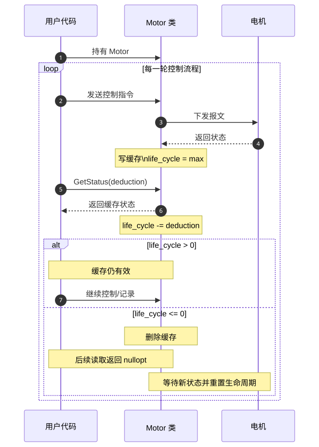

# EncosMotorDriver 使用指南

本文档面向终端用户，介绍如何加载适配器插件、查询可用资源，以及获取总线与电机实例进行控制。

---

## 一、Adapter 插件加载

`EncosMotorDriver` 支持两种构建形态：

- **动态模式**：适配器以动态库形式提供，在运行期按需加载
- **静态模式**：启用的适配器直接编进主库，不再依赖运行期插件目录

### 1.1 插件搜索路径

动态模式下，系统默认从环境变量 `ENCOS_PLUGIN_PATH` 指定的目录查找插件。你也可以在代码中显式设置插件目录：

```cpp
#include <encos/encos_driver.h>

// 设置自定义插件目录
encos::SetPluginPath("/opt/encos/plugins");

// 创建适配器实例
auto* adapter = encos::MakeAdapter("Can", "can0");
```

静态模式下 `SetPluginPath()` 保留接口，但不会影响适配器加载行为。

### 1.2 创建适配器实例

使用 `encos::MakeAdapter()` 创建适配器，参数说明如下：

| 参数 | 说明 | 示例 |
|------|------|------|
| `adapter_type` | 适配器类型名称 | `"Can"`、`"Ethercat"`、`"UsbSerial"` |
| `interface_name` | 网络/通信接口名称 | `"can0"`、`"eth0"`、`"/dev/ttyUSB0"` |
| `logger_name` | （可选）日志记录器名称 | 默认与`interface_name`相同 |
| `log_level` | （可选）日志级别 | 默认为 `encos::LogLevel::Info` |

```cpp
// 创建 CAN 适配器
auto* can_adapter = encos::MakeAdapter("Can", "can0");

// 创建 EtherCAT 适配器，并指定日志级别为 debug
auto* ec_adapter = encos::MakeAdapter("Ethercat", "eth0", "my_ec", encos::LogLevel::Debug);
```

### 1.3 所有权与删除

Adapter、Bus、Motor、Battery、Imu 和 Pms 均由进程级 `EncosDriverManager` 拥有。
创建及查询接口返回的是非拥有裸指针，调用方不得直接 `delete`，也不得把它们包装进拥有型智能指针。
`DeleteAdapter(adapter)` 会注销接收路由并级联删除其全部 Bus 和设备；删除完成后，相关裸指针全部失效。
如需提前释放子对象，可调用 `DeleteBus`、`DeleteMotor`、`DeleteBattery`、`DeleteImu` 或 `DeletePms`。

```cpp
auto* adapter = encos::MakeAdapter("Can", "can0");
auto* bus = adapter->GetBus(0);
auto* motor = bus->GetMotor(1, encos::MotorModel::EC_A4310_P2);

// 使用完成后只删除所有权树的根；不要再访问 bus 和 motor。
if (!encos::DeleteAdapter(adapter)) {
    throw std::runtime_error("adapter 不受管理器管理或已被删除");
}
```

设备状态回调由 Adapter 的接收线程同步调用。回调应只做短小、非阻塞的工作；耗时计算、
文件或网络 I/O 应转交其他线程，以免阻塞同一 Adapter 的后续消息分发。

当前可用的适配器类型包括：

- **Ethercat** — EtherCAT 协议适配器
- **EthercatIGH** — IGH 主站 EtherCAT 适配器
- **EthercatWindows** — Windows 平台 EtherCAT 适配器
- **Can** — Linux SocketCAN 适配器
- **UsbSerial** — USB 串口适配器（建议仅用于临时调试）
- **Slcan** — slcan 虚拟 CAN 设备适配器（如 Canable 等）

> 动态模式下，如果插件文件未找到或加载失败，`MakeAdapter` 会抛出 `std::runtime_error`。

### 1.4 直接发送与软同步模式

默认模式下，设备消息会直接交给具体 Adapter；无需调用 `Commit()`。若需要控制一条
Bus 的批次边界，请调用该 Bus 的 `Commit()` 或 `SetSyncMode(true)`：从此以后该 Bus 的
消息会保留到下一次 `bus->Commit()`，而同一 Adapter 的其他 Bus 继续按各自模式发送。
`bus->SetSyncMode(false)` 会提交本 Bus 已保留的消息并恢复直接发送。

`adapter->Commit()` 与 `adapter->SetSyncMode(bool)` 为兼容接口，等价于对当前所有 Bus
执行相应批量操作，并会成为后续新建 Bus 的默认模式。首次 Commit 不会重新收集此前已经
直接交给具体 Adapter 的普通消息；如需让第一批控制指令受控，应先显式进入同步模式。

> **必须遵守的初始化顺序**：先在默认直接发送模式下完成 Bus 扫描以及 Motor、Battery、
> Pms 等设备的全部创建和初始化，再调用 `bus->SetSyncMode(true)`、`bus->Commit()` 或
> Adapter 级批量接口。
> 通过固件初始化电机、读取或设置参数等“发送后在同一线程等待响应”的操作也必须在进入
> 软同步模式前完成。软同步模式不会为这些创建、初始化或请求响应接口自动调用
> `Commit()`；顺序错误会使请求留在该 Bus 的同步队列中并最终超时。

```cpp
auto* adapter = encos::MakeAdapter("Can", "can0");
auto* bus = adapter->GetBus(0);

// 先完成扫描、设备创建和所有需要等待响应的初始化。
auto motors = bus->ScanMotors();
auto* motor = bus->GetMotor(1, encos::MotorModel::EC_A4310_P2);

// 设备完全就绪后，仅让这条 Bus 进入软同步模式。
bus->SetSyncMode(true);

motor->SpdControl<0>(1.0F, 2.0F);
bus->Commit();
```

`bus->Commit()` 或 `adapter->Commit()` 返回只表示具体 Adapter 已接收这一批消息，不表示
物理 CAN/EtherCAT/串口发送完成，也不表示设备已经执行或返回响应。对于 EtherCAT 和
RelayWs，同一 Bus 的不同同步批次不会被合入同一个底层输出包；不同 Bus 仍可复用可用槽位。
具体 Adapter 原有的发送循环、重试和周期调度方式不受软同步模式影响。

---

## 二、查询 AdapterType 与可用接口

在创建适配器之前，你可以查询系统中可用的适配器类型及其对应的网络接口，便于动态配置或自动生成设备列表。

### 2.1 查询所有可用的适配器类型

```cpp
std::vector<std::string> types = encos::GetAvailableAdapterTypes();
for (const auto& t : types) {
    std::cout << "Available adapter: " << t << std::endl;
}
```

该函数返回当前插件目录中所有可加载的适配器类型名称列表，结果按字母顺序排列。

### 2.2 查询指定适配器的可用接口

```cpp
std::vector<std::string> ifaces = encos::GetAvailableInterface("Can");
for (const auto& iface : ifaces) {
    std::cout << "CAN interface: " << iface << std::endl;
}
```

不同适配器类型返回的接口来源不同：

| 适配器类型 | 接口类型 | 典型示例 |
|-----------|----------|----------|
| `Ethercat` / `EthercatIGH` | 有线以太网接口 | `eth0`、`enp3s0` |
| `UsbSerial` / `Slcan` | 串口设备 | `/dev/ttyUSB0`、`COM3` |
| `Can`（仅 Linux） | CAN 总线接口 | `can0`、`vcan0` |

---

## 三、从 Adapter 获取 Bus

`Bus` 表示一条独立的通信总线，负责管理该总线上的电机。根据适配器类型的不同，一个适配器可能管理一条或多条总线。

### 3.1 获取单条总线

对于 CAN、UsbSerial、Slcan 等单一总线适配器，直接调用 `GetBus()`：

```cpp
auto adapter = encos::MakeAdapter("Can", "can0");
auto bus = adapter->GetBus();        // 获取总线索引为 0 的总线
// 或显式指定索引
auto bus = adapter->GetBus(0);
```

### 3.2 获取多从站/多总线场景下的总线

对于 EtherCAT 等多从站适配器，需要指定从站索引和总线索引：

```cpp
auto adapter = encos::MakeAdapter("Ethercat", "eth0");
auto bus = adapter->GetBus(0, 0);    // 从站 0，总线 0
```

### 3.3 枚举适配器管理的所有总线

```cpp
auto adapter = encos::MakeAdapter("Ethercat", "eth0");
auto buses = adapter->GetBuses();
for (const auto& [idx, bus] : buses) {
    std::cout << "Bus index: " << idx << std::endl;
}
```

`GetBuses()` 返回当前适配器下所有已知总线的快照，方便批量操作。

---

## 四、从 Bus 获取 Motor

`Bus` 提供了多种方式获取电机实例，适用于"已知型号"、"已知参数"和"自动发现"等不同使用场景。

### 4.1 通过已知电机型号创建

当你明确知道电机型号时，可直接传入 `MotorModel` 枚举。库会使用该型号预定义的 PVT 控制范围和电流量程，**无需向电机固件查询参数**：

```cpp
auto bus = adapter->GetBus(0);
auto motor = bus->GetMotor(1, encos::MotorModel::EC_A4310_P2);

// 直接进行速度控制
motor->SpdControl<0>(1.0f, 2.0f);
```

预定义的电机型号包括 `EC_A4310_P2`、`EC_A8112_P1`、`EC_A10020_P1_6_72V` 等，完整列表见 `include/motor/motor_model_generated.h`。

### 4.2 通过自定义 PVT 范围创建

如果电机型号不在预定义列表中，或需要手动指定参数范围，可传入 `MotorPVTRanges` 结构：

```cpp
encos::MotorPVTRanges ranges;
ranges.kp        = {0.0f, 500.0f};
ranges.kd        = {0.0f, 5.0f};
ranges.position  = {-12.5f, 12.5f};
ranges.speed     = {-40.0f, 40.0f};
ranges.torque    = {-10.0f, 10.0f};
ranges.current   = {-20.0f, 20.0f};
ranges.kt        = 0.095f;

auto motor = bus->GetMotor(1, ranges);
motor->PVTControl<0>(10.0f, 1.0f, 0.5f, 1.0f, 5.0f);
```

### 4.3 通过固件自动初始化创建

如果不需要预先了解电机参数，可仅提供电机索引。库会在首次创建时自动向电机固件查询 PVT 范围并完成初始化：

```cpp
auto motor = bus->GetMotor(1);
// 自动完成参数查询
motor->PosControl<0>(3.14f, 10.0f, 5.0f);
```

> **注意**：此方法在首次创建时会阻塞，等待电机返回参数响应。

### 4.4 获取已创建的电机实例

若只想获取此前已创建的电机（不触发新建），可使用 `SelectMotor`。如果该索引的电机尚未创建，返回 `nullptr`：

```cpp
auto motor = bus->SelectMotor(1);
if (motor) {
    auto status = motor->GetStatus();
}
```

也可通过 `GetMotors()` 获取当前总线上所有已创建电机的快照：

```cpp
auto motors = bus->GetMotors();
for (const auto& [idx, motor] : motors) {
    std::cout << "Existing motor ID: " << idx << std::endl;
}
```

### 4.5 扫描总线发现电机

当总线上电机索引未知时，可执行扫描操作。库会广播发现指令并收集响应：

```cpp
auto motors = bus->ScanMotors();
std::cout << "Discovered " << motors.size() << " motor(s)" << std::endl;
for (const auto& [idx, motor] : motors) {
    std::cout << "  Motor ID: " << idx << std::endl;
}
```

- **ScanMotors()**：先使用 CAN FD 完成一轮查询，再使用普通 CAN 完成一轮查询；同一 ID
  对两种协议均有响应时按 CAN FD 电机处理。

扫描前，库会先清空当前 Bus 的缓冲区并等待短暂观察窗口，用于判断该 Bus 上是否已经存在持续上报的外部设备流量。如果检测到新流量，当前 Bus 会被标记为外部设备总线，`ScanMotors()` 直接返回空结果，不再继续全 ID 电机扫描。后续显式调用 `DetectExternalDevice()` 会重新观察 1 秒，并按最新结果更新该标记。

> 扫描操作会阻塞当前线程，等待电机响应完成。扫描结果会更新总线上的电机列表。

### 4.6 获取电池设备

当总线上挂载的是 BMS/电池设备而不是电机时，可通过 `GetBattery()` 获取电池包装器：

```cpp
auto battery = bus->GetBattery(0);
```

调用 `GetBattery()` 后，当前 Bus 会被视为外部设备总线，后续 `ScanMotors()` 会直接返回空结果；已知 ID 的电机包装器创建、选择和获取不受该标记限制。

电池对象提供两类能力：

- 状态监听：`GetStatus()` 返回 `0x3F4`、`0x2F4`、`0x0F4`、`0x1F4` 汇总后的状态快照。
- 主控命令：可通过 `SendPassiveCommands()` 或薄封装方法如 `ClearFault()`、`RequestCharging(bool)`、`AllowDischarge(bool)` 向 `0x4F4 + idx` 发送控制位。

如果需要订阅状态变化，可注册回调：

```cpp
battery->SetOnStatus([](const encos::BatteryStatus& status) {
    if (status.state.has_value()) {
        std::cout << "SOC: " << status.state->soc * 100.0f << "%" << std::endl;
    }
});
```

电池状态回调在每次后台 update pass 中最多触发一次；即使该次 pass 同时处理了多个电池上报包，也会在合并完成后只回调一次。

---

## 五、Motor 常用操作

`Motor` 提供标零、参数配置、状态读取和运动控制等方法。以下按功能分组简要说明，并标注各方法的阻塞行为。

### 5.1 标零

| 方法 | 说明 | 阻塞行为 |
|------|------|----------|
| `ResetZeroPos(bool wait_for_ack = true)` | 将当前位置设为零点 | `wait_for_ack=true` 时阻塞等待确认，`false`则立即返回设置成功 |
| `GotoLimit(limit, dir, spd, cur, timeout)` | 向限位方向运动并触碰限位，返回零点偏移量 | **阻塞**，直到触碰限位或超时（失败返回 NaN） |
| `GotoZero(offset, spd, cur, timeout)` | 运动到零位并应用偏移量重置零点 | **阻塞**，直到到位或超时 |
| `Calibrate(limit, dir, spd, cur, timeout)` | 依次执行 `GotoLimit` 和 `GotoZero`，完成一键校准 | **阻塞**，直到校准完成或超时 |

示例：

```cpp
// 自动校准：在 ±12.5 rad 范围内，向正方向运动
bool ok = motor->Calibrate({-12.5f, 12.5f}, 1);
```

### 5.2 设置参数

`Motor` 提供一系列 `SetXxx` 方法用于修改电机固件参数，均带有 `wait_for_ack` 参数（默认 `true`）：

- `wait_for_ack = true`：**阻塞**等待电机确认后返回
- `wait_for_ack = false`：发送指令后立即返回，不等待确认

```cpp
motor->SetAcceleration(10.0f);                       // 阻塞，设置加速度
motor->SetKt(0.095f, false);                         // 非阻塞，设置扭矩常数 Nm/A
motor->SetCurPI(1.0f, 0.1f);                         // 阻塞，设置电流环 PI
motor->SetSpdPI(0.5f, 0.05f);                        // 阻塞，设置速度环 PI
motor->SetPosPD(10.0f, 1.0f);                        // 阻塞，设置位置环 PD
motor->SetPVTPosRange({-12.5f, 12.5f});              // 阻塞，设置 PVT 位置范围
motor->SetPVTSpdRange({-40.0f, 40.0f});              // 阻塞，设置 PVT 速度范围
motor->SetPVTCurRange({-20.0f, 20.0f});              // 阻塞，设置 PVT 电流范围
motor->SetCanTimeout(100);                           // 阻塞，设置 CAN 超时 ms
```

### 5.3 读取参数

使用模板方法 `GetParameter<Param>()` 查询电机固件参数，返回类型由模板参数自动推导：

```cpp
float pos = motor->GetParameter<encos::MotorParameter::Position>();     // rad
float spd = motor->GetParameter<encos::MotorParameter::Speed>();        // rad/s
float cur = motor->GetParameter<encos::MotorParameter::Current>();      // A
auto version = motor->GetParameter<encos::MotorParameter::Version>();   // Version 结构体
```

> **阻塞行为**：`GetParameter` 会发送查询指令并**阻塞等待**电机响应，返回后才继续执行。完整支持的参数列表见 API 头文件。

### 5.4 运动控制

所有控制方法均采用模板参数 `FeedbackType` 决定反馈行为：

- `FeedbackType == 0`：指令发送后立即返回 `void`（**非阻塞发令**）
- `FeedbackType >= 1`：**阻塞等待**电机反馈，返回对应的反馈结构体

> 当使用非阻塞发令（`FeedbackType == 0`）时，方法不会返回电机状态。如需获取状态，参见 [第七章](#七电机控制流)。

#### PVT 力位混控（详细介绍）

```cpp
template <int FeedbackType>
auto PVTControl(float kp, float kd, float pos, float spd, float torque);
```

参数分别为比例增益、微分增益、目标位置（rad）、目标速度（rad/s）、目标扭矩（Nm）。

示例：

```cpp
// 非阻塞发令
motor->PVTControl<0>(10.0f, 1.0f, 0.5f, 1.0f, 5.0f);

// 阻塞等待反馈
auto fb = motor->PVTControl<1>(10.0f, 1.0f, 0.5f, 1.0f, 5.0f);
// fb 包含位置、速度、电流、温度等字段
```

#### 其他控制方法

以下方法与 `PVTControl` 具有类似的模板签名和反馈行为，仅控制模式不同：

| 方法 | 说明 |
|------|------|
| `PosControl<FeedbackType>(position, speed, current, feedback)` | 位置控制 |
| `SpdControl<FeedbackType>(speed, current, feedback)` | 速度控制 |
| `CurControl<FeedbackType>(current, feedback)` | 电流控制 |
| `TorControl<FeedbackType>(torque, feedback)` | 扭矩控制 |
| `Stop<FeedbackType>(mode, current, feedback)` | 刹车/停止，支持多种制动模式 |

与 `PVTControl` 不同的是，上述方法均带有一个额外的 `feedback` 参数（默认等于模板参数 `FeedbackType`），允许你在运行期覆盖反馈行为。例如，即使模板参数为 `0`，也可以通过指定 `feedback` 来请求返回电机状态：

```cpp
// 模板参数为 0，但通过 feedback 参数请求返回状态
auto fb = motor->PosControl<0>(3.14f, 10.0f, 5.0f, 1);
```

此外，`Brake(bool enabled)` 用于显式启用或释放刹车抱闸，默认**阻塞**等待确认。

> **重要提示**：`Motor` 对象在创建后会保持独立工作，即使原始的 `Bus` 和 `Adapter` 对象被释放，已获取的 `Motor` 仍然可以正常发送控制指令。但这也意味着你无法通过 `Motor` 反向获取到它所属的 `Bus` 或 `Adapter`。如果你后续仍需要操作总线（如扫描新电机）或访问适配器状态，请在创建电机前保留 `adapter` 和 `bus` 的实例。

---

## 六、电机获取到使用示例

### 示例 1：扫描并控制电机（EtherCAT）

```cpp
#include <iostream>
#include <thread>
#include <encos/encos_driver.h>

int main() {
    // 创建 EtherCAT 适配器
    auto adapter = encos::MakeAdapter("Ethercat", "eth0");
    std::this_thread::sleep_for(std::chrono::seconds(1));

    // 获取从站 0 的总线 0
    auto bus = adapter->GetBus(0, 0);

    // 扫描总线上的电机
    auto motors = bus->ScanMotors();
    std::cout << "Discovered motors: ";
    for (const auto& [idx, motor] : motors) {
        std::cout << idx << " ";
    }
    std::cout << std::endl;

    // 周期性地对所有发现的电机发送速度指令
    while (true) {
        for (const auto& [idx, motor] : motors) {
            motor->SpdControl<0>(1.0f, 2.0f);
        }
        std::this_thread::sleep_for(std::chrono::milliseconds(10));
    }

    return 0;
}
```

### 示例 2：直接创建已知型号电机（CAN FD）

```cpp
auto adapter = encos::MakeAdapter("Can", "can0");
auto bus = adapter->GetBus(0);

// 第三个参数为 true，明确按 CAN FD 电机创建
auto motor = bus->GetMotor(1, encos::MotorModel::EC_A4310_P2, true);

// 发送 PVT 力位混控指令
motor->PVTControl<1>(10.0f, 1.0f, 0.5f, 1.0f, 5.0f);
```

`GetMotor(index, model, true)` 中的 `true` 表示后续报文使用 CAN FD；如果电机使用普通
CAN，应传入 `false`。不确定协议或需要自动发现时，使用 `ScanMotors()`：扫描会先查询
CAN FD，再查询普通 CAN；同一 ID 同时响应时，返回的电机会按 CAN FD 处理。

---

## 七、电机控制流

`EncosMotorDriver` 提供了三种电机控制流，分别适用于不同的实时性要求和应用场景。所有控制流均围绕控制指令的反馈机制展开。

### 7.1 发送-应答模式

**适用场景**：需要即时获取电机当前状态的场合，如单步调试、位置确认。

在调用控制指令时，将模板参数 `FeedbackType` 设为 `1`（或更高），函数会**阻塞等待**电机返回反馈数据包，并将解析后的状态结构体直接返回给调用者：

```cpp
// PVT 控制，阻塞等待反馈
auto fb = motor->PVTControl<1>(10.0f, 1.0f, 0.5f, 1.0f, 5.0f);
// fb 包含位置(rad)、速度(rad/s)、电流(A)、温度(°C)等字段

// 位置控制，阻塞等待反馈
auto fb2 = motor->PosControl<1>(3.14f, 10.0f, 5.0f);
```

**特点**：
- 调用线程阻塞，直到收到电机响应或超时
- 一次调用完成"发令+收状态"，逻辑简单直观
- 返回值类型由模板参数精确决定，不会出现缺失值
- 不依赖外部状态缓存，数据实时性最好
- 高频调用时阻塞开销较大

### 7.2 发送-回调模式

**适用场景**：高频周期性控制，需要异步接收电机状态但不希望阻塞发令线程。

将模板参数 `FeedbackType` 设为 `0`（非阻塞），同时在函数参数中传入所需的回报类型（`feedback ≥ 1`）。指令发送后函数立即返回 `void`，电机异步返回的状态将通过 `Motor::SetOnStatus` 注册的回调函数递送给用户：

```cpp
// 1. 注册状态回调
motor->SetOnStatus([](const encos::MotorStatus& status) {
    std::cout << "Pos: " << status.position
              << " Spd: " << status.speed << std::endl;
});

// 2. 非阻塞发令，但通过 feedback 参数请求电机返回状态
motor->SpdControl<0>(1.0f, 2.0f, 1);  // 第三个参数 feedback=1 请求反馈
```

**特点**：
- 发令非阻塞，适合高频控制循环（如 1kHz 发令）
- 电机状态通过回调异步通知，无需主动查询
- 回调在适配器接收线程中执行，应注意线程安全
- 回调触发时机取决于总线负载和电机响应速度

### 7.3 发送-轮询模式

**适用场景**：最常见的高频控制逻辑，控制循环与状态查询分离，如主循环发令、监控线程查询状态。

将模板参数 `FeedbackType` 和函数参数 `feedback` 均设为 `0`。指令发送后立即返回，用户可在需要时通过 `Motor::GetStatus()` 主动查询最近一次缓存的状态：

```cpp
// 高频控制循环（非阻塞）
while (running) {
    motor->SpdControl<0>(1.0f, 2.0f);  // feedback 默认为 0
    std::this_thread::sleep_for(std::chrono::milliseconds(1));
}

// 另一个线程低频查询状态
auto status = motor->GetStatus();
if (status) {
    std::cout << "Current: " << status->current << std::endl;
}
```

**潜在问题**：由于状态是缓存的，`GetStatus()` 返回的可能是**许久之前**的状态。如果电机已离线或通信中断，用户仍可能读到旧数据而误以为电机正常工作。

为解决轮询模式下旧状态污染的问题，库引入了**状态生命周期（Life Cycle）**机制。其核心思想是：将每个缓存状态视为有"保质期"的数据，每次读取都会消耗其生命周期，过期即自动清除。

#### 生命周期工作原理

1. **状态写入（新数据到达）**：当适配器收到电机的状态数据包时，将该状态存入缓存，并将其生命周期重置为最大值 `max_life_cycle`。

2. **状态读取（GetStatus）**：每次调用 `GetStatus()` 时，会从缓存中读取状态，并将该状态的生命周期扣减 `life_cycle_deduction`（默认值为 `1`）。

3. **过期清理**：如果生命周期被扣减至 `0` 及以下，该状态条目会被**立即删除**。此时再次调用 `GetStatus()` 将返回 `std::nullopt`，提示调用者当前没有有效状态。

```cpp
// 获取状态（默认扣减 1 点生命周期）
auto status = motor->GetStatus();           // deduction = 1

// 仅读取状态而不扣减生命周期（ peek 模式）
auto status = motor->GetStatus(0);          // deduction = 0，不消耗生命周期

// 一次性大量扣减生命周期
auto status = motor->GetStatus(10);         // deduction = 10
```

#### 生命周期配置

生命周期参数在**适配器级别**进行配置，影响该适配器下所有电机：

```cpp
// 设置状态最大生命周期为 5
// 意味着一个状态最多可被读取 5 次（默认 deduction=1）后过期
adapter->SetMaxStatusLifeCycle(5);

// 禁用生命周期机制（默认值 INT_MAX，状态永不过期）
adapter->SetMaxStatusLifeCycle(std::numeric_limits<int>::max());

// 查询当前配置
int cycle = adapter->GetMaxStatusLifeCycle();
```

#### 用户代码-Motor 类-电机跨职能流程图

下图从三个参与方的角度展示了轮询模式下的通信路径，以及状态缓存从写入、读取、扣减到过期清理的完整生命周期：



#### 生命周期建议配置

对于发送-轮询模式，建议优先将：

```cpp
adapter->SetMaxStatusLifeCycle(2);  // 或 3
```

配置为 `2~3`。这个数值可理解为：**每一轮电机控制流程对应允许读取状态 2~3 次**。这里的“一轮控制流程”通常指一次控制指令发出后，到下一次来自同一电机的新状态帧覆盖旧缓存之前的这段时间。

- 配置为 `2`：适合“控制线程发令 + 一个监控线程读取”的常见模型。第一次读取通常由主控制逻辑消费，第二次读取留给日志、保护逻辑或上位机监控；若之后仍无新状态到达，缓存会尽快失效，能更早暴露链路中断或电机离线问题。
- 配置为 `3`：适合除了主控制逻辑外，还存在额外一个状态消费者的场景，例如监控线程与录波线程都需要各读取一次。它比 `2` 略宽松，但仍能把旧状态限制在很短的可见窗口内。

不建议将生命周期配置得过大。数值越大，旧状态在缓存中的存活时间越长，`GetStatus()` 就越可能在通信已中断时仍返回“看起来正常”的历史数据，导致离线检测、故障判定或状态同步滞后。除非你明确需要让多个独立模块重复消费同一帧状态，否则应优先使用 `2`，在确有额外读取需求时再提高到 `3`。


### 7.4 电机状态数据结构

在发送-回调和发送-轮询模式中，电机状态均通过 `encos::MotorStatus`（即 `MotorFeedbackMsg1`）传递，其结构如下：

```cpp
struct MotorStatus {
    MotorError error = MotorError::NoResponse;
    float position = NaN;            // rad
    float speed = NaN;               // rad/s
    float current = NaN;             // A
    float motor_temperature = NaN;   // °C
    float mos_temperature = NaN;     // °C
};
```

> **注意**：`MotorStatus` 虽然包含了所有可能的回报数据，但**实际填充的字段取决于你设置的回报类型**。例如，当回调中设置 `feedback = 2` 时，电机可能只返回位置、电流和温度，此时 `speed` 字段将保持默认值 `NaN`。在读取状态数据前，建议检查字段是否为 `NaN`，或使用 `std::isnan()` 进行判断。

这与发送-应答模式不同：后者由模板参数决定精确的返回值类型（`MotorFeedbackMsg1` / `MotorFeedbackMsg2` / `MotorFeedbackMsg3`），因此返回的结构体一定与回报类型完全对应，不存在缺失值的问题。

### 7.5 控制流对比

| 特性 | 发送-应答模式 | 发送-回调模式 | 发送-轮询模式 |
|------|--------------|--------------|--------------|
| 阻塞性 | 阻塞 | 非阻塞 | 非阻塞 |
| 状态获取方式 | 返回值直接携带 | `SetOnStatus` 回调 | `GetStatus()` 主动查询 |
| 实时性 | 最高（当前指令对应状态） | 高（异步通知） | 中（依赖缓存，需配合生命周期） |
| 适用频率 | 低频（<100Hz） | 高频 | 高频 |
| 线程模型 | 单线程同步 | 多线程（发令+回调） | 多线程（发令+查询） |
| 额外配置 | 无 | 需注册回调 | 建议配置生命周期 |

### 7.6 控制流程图

下图展示了三种控制流的交互方式。生命周期细节仅属于发送-轮询模式的缓存管理策略，因此不再放入总览图中：



---

## 八、bench / stress 测试工具

`bench` 和 `stress` 命令已合并到 `motor_cli` 的 `emcli bench` 和 `emcli stress`。请参阅 `motor_cli` 仓库的文档获取使用说明。

```bash
./build/emcli bench Can:can0
./build/emcli stress Ethercat:eth0
```

## 九、Linux 系统配置与线程部署建议

新版本驱动不要求 CPU 隔离，也不会把通信线程绑定到固定 CPU。Linux 部署主要需要确认
总线访问权限和实时线程优先级权限。

### 9.1 基础运行权限

#### EtherCAT 相关权限

`Ethercat` 插件需要底层网络访问权限。安装阶段程序会尝试为相关可执行文件设置：

- `CAP_NET_RAW`
- `CAP_NET_ADMIN`

如果这些权限可用，程序会自动完成底层资源获取，用户通常不需要手工打开网口或单独申请文件描述符。

程序还会通过受限的线程优先级 helper，把插件通信 loop 设置为 `SCHED_FIFO 50`。helper
只持有 `CAP_SYS_NICE`，且只能修改直接调用进程中的目标线程。若安装阶段未成功设置
capability，首次启动通信 loop 时可以通过 GUI 显式授权；拒绝授权不会阻止驱动运行，
但线程会保留原调度策略。

#### CAN 相关权限

`Can` 插件会在具备权限时自动完成 CAN 口初始化，包括：

1. `ip link set <ifname> down`
2. `ip link set <ifname> type can bitrate 1000000`
3. `ip link set <ifname> up`

也就是说，**CAN 端口启用与 bitrate 配置由程序自动处理**，用户通常不需要手工先执行这些命令；相应权限在安装时程序会自动尝试赋予，如果赋予失败则需要根据错误提示手动处理。

### 9.2 本程序的线程模型

可以把程序理解为下面几类线程：

1. **你的控制线程**
   - 由你自己创建
   - 负责主控制循环、轨迹规划、状态机、监控等逻辑
   - 调用 `Motor::PosControl/SpdControl/PVTControl/GetStatus/...`

2. **驱动通信线程**
   - 创建 `Adapter` 后，驱动会自动启动内部通信线程
   - 它负责和总线、电机进行收发

如果使用 `SetOnStatus()`，回调是在适配器接收线程上下文中同步执行的，不是独立的第三类
线程；因此回调逻辑应尽量轻量，不要在回调里做阻塞操作。

### 9.3 驱动内部已自动处理的部分

- `Can` 会自动启用接口并完成基础配置。
- CAN、EtherCAT、USB-Serial、SLCAN 和 RelayWs 的主通信 loop 会自动请求
  `SCHED_FIFO 50`。
- 驱动不会修改任何线程的 CPU affinity，也不要求更改内核启动参数。

### 9.4 用户线程优先级设置

应用自己的控制线程可以复用驱动提供的接口：

```cpp
#include <utils/thread_priority.h>

std::thread control_thread([]() {
    if (!encos::utils::SetCurrentThreadPriority(48)) {
        // 授权被拒绝或当前平台不支持，线程仍可继续运行。
    }
    while (true) {
        // 控制循环
    }
});
```

建议优先级分配如下：

- 驱动通信线程：`50`
- 用户主控制线程：`45 ~ 49`
- 辅助监控线程：`40 ~ 44`

不要把你的控制线程优先级设置得高于驱动通信线程。否则在高负载时，控制线程可能反过来压制底层收发线程，导致状态回传变慢，甚至放大超时和抖动。

### 9.5 优先级继承注意事项

这一点需要特别注意：**只把线程改成实时优先级还不够，锁的优先级继承同样重要。**

原因是高优先级控制线程经常会和其他线程共享：

- 状态缓存
- 控制命令队列
- 日志队列
- 用户自定义状态机数据

如果一个低优先级线程先持有锁，而高优先级线程随后等待这把锁，就会出现**优先级反转**。这会直接破坏实时性，表现为控制周期偶发拉长、状态读取抖动，甚至看起来像随机卡顿。

程序内部已经对部分关键锁启用了 `PTHREAD_PRIO_INHERIT`，但**你自己在应用层创建的 mutex 不会自动获得这个属性**，需要手动设置。

参考写法：

```cpp
#include <pthread.h>

pthread_mutex_t g_mutex;

void InitRealtimeMutex() {
    pthread_mutexattr_t attr;
    pthread_mutexattr_init(&attr);
    pthread_mutexattr_setprotocol(&attr, PTHREAD_PRIO_INHERIT);
    pthread_mutex_init(&g_mutex, &attr);
    pthread_mutexattr_destroy(&attr);
}
```

建议：

- 实时线程之间共享的数据尽量少
- 锁保护区尽量短
- 不要在持锁期间做日志、内存分配、文件 IO 或阻塞等待
- 若必须跨线程传递数据，优先采用无锁队列、双缓冲或单生产者/单消费者结构

### 9.6 排查建议

如果仍然出现周期抖动或高丢包率，建议依次确认：

1. helper 的 `CAP_SYS_NICE` 和通信线程实时优先级是否生效
2. 如果丢包率较高，建议启用软同步模式，即在每一轮消息发送完成后显式调用
   `bus->Commit()`（不要让程序根据消息内容推算批次边界）
3. 应用控制线程是否使用低于驱动通信线程的合理优先级
4. 是否存在普通线程长时间持锁导致的优先级反转
5. 日志、内存分配、文件 IO 或其他阻塞工作是否进入实时路径
